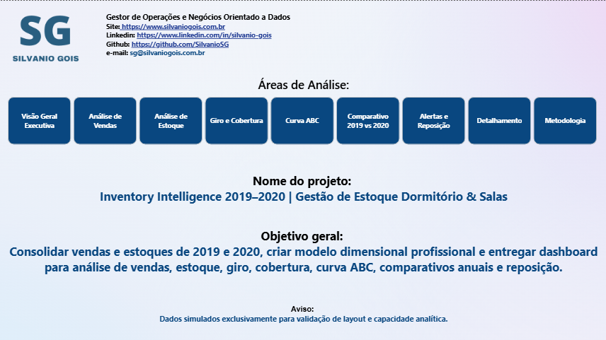
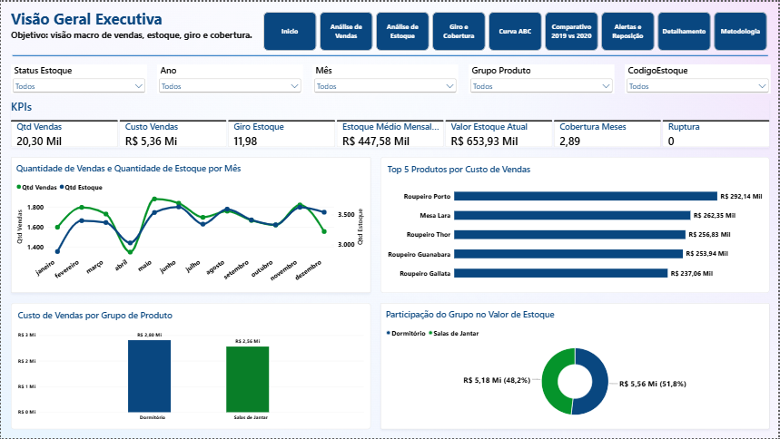
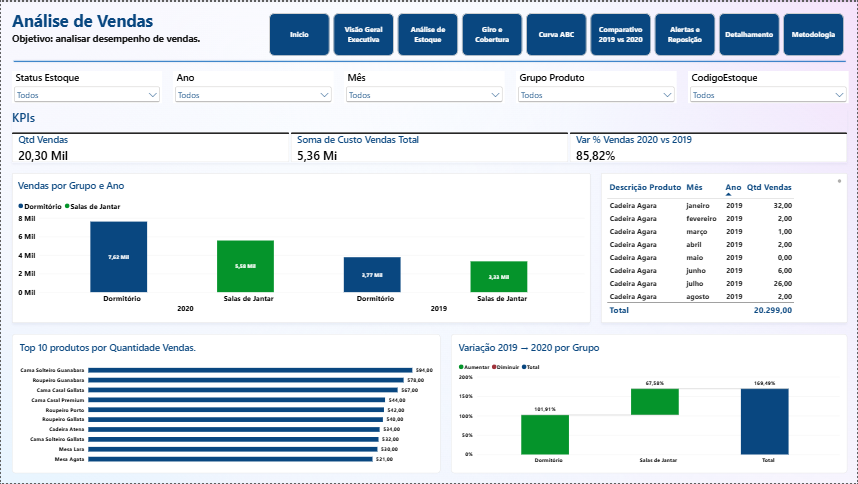
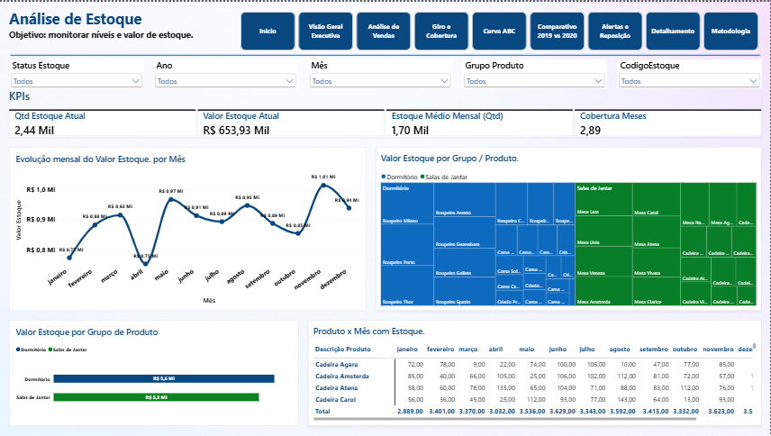
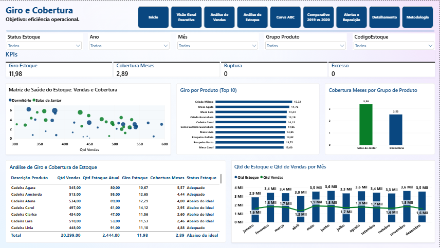
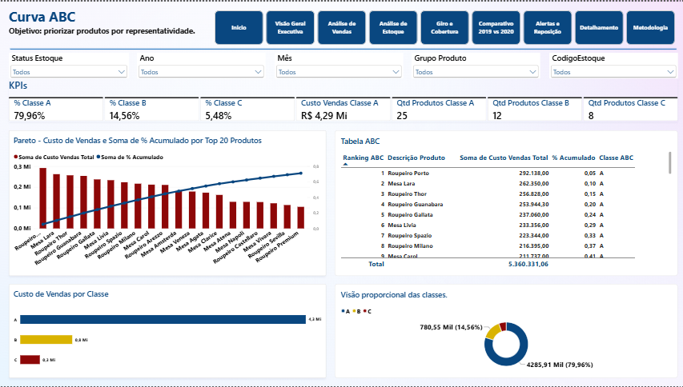
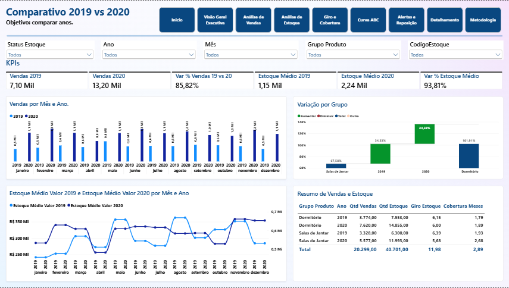
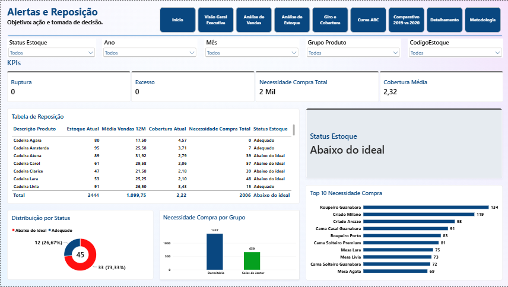
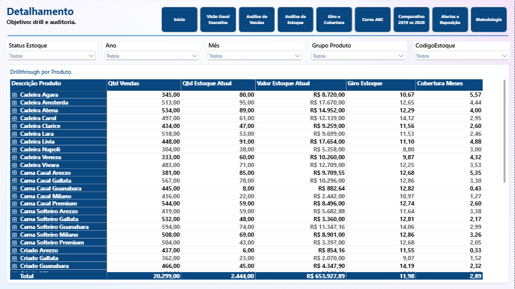
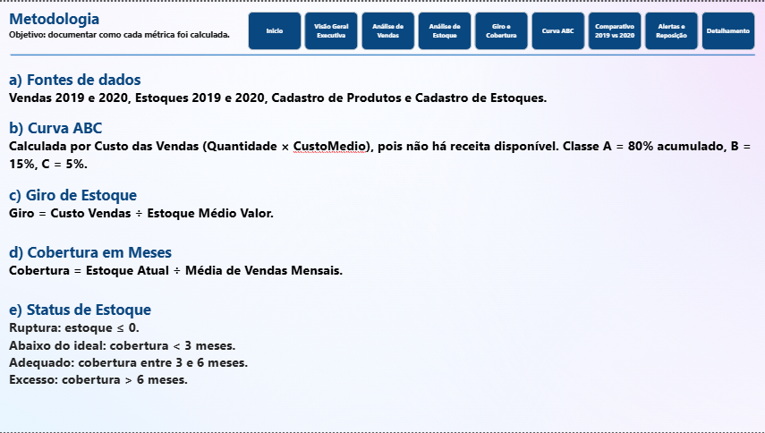

# Inventory Intelligence 2019–2020 | Gestão de Estoque Dormitório & Salas

**Dashboard analítico desenvolvido em Power BI para consolidação, tratamento e análise de vendas e estoques dos anos de 2019 e 2020, com foco em gestão de estoque, giro, cobertura, curva ABC, comparativo anual e reposição.**

[🌐 Site Oficial](https://www.silvaniogois.com.br) | [💼 LinkedIn](https://www.linkedin.com/in/silvanio-gois/) | [🚀 Projeto Online (Power BI)](https://app.powerbi.com/view?r=eyJrIjoiNThjOWI4ZTYtYjFkNS00OTlkLTlmMmUtNDIyNmNiMzQxYzcxIiwidCI6IjJlYmQyYzU0LWY1ZDMtNGVmYi05ZGE3LWU4Yzk0YmQyMWQzOSJ9)

---

## 👨‍💻 Autor
**Silvanio Gois** — Gestor de Operações e Negócios Orientado a Dados

---

## 📋 1. Visão Geral
O projeto **Inventory Intelligence 2019–2020** foi construído para responder a perguntas operacionais e estratégicas de gestão de estoque a partir de uma base histórica de dois anos. A solução integra dados de vendas, estoques e cadastros em um modelo dimensional, permitindo análises de desempenho, eficiência e necessidade de reposição.

> **Objetivos principais:**
> * Consolidar vendas e estoques de 2019 e 2020 em um único modelo analítico.
> * Estruturar modelo dimensional com tabelas fato e dimensão.
> * Entregar dashboard com análises de vendas, estoque, giro, cobertura, curva ABC, comparativo anual e reposição.
> * Apoiar decisões de compra, reposição e priorização de produtos.

---

## 🗂️ 2. Arquivos do Projeto

### Fontes de dados utilizadas:
* `CadastroEstoque.xlsx`
* `CadastroProduto.xlsx`
* `Estoque2019.xlsx`
* `Estoque2020.xlsx`
* `Venda2019.xlsx`
* `Venda2020.xlsx`

### Arquivos gerados:
* `InventoryIntelligence2019–2020.pbix`
* `InventoryIntelligence2019–2020.pdf`

### Capturas das páginas do relatório:
* `pagina1.png` — Início
* `pagina2.png` — Visão Geral Executiva
* `pagina3.png` — Análise de Vendas
* `pagina4.png` — Análise de Estoque
* `pagina5.png` — Giro e Cobertura
* `pagina6.png` — Curva ABC
* `pagina7.png` — Comparativo 2019 vs 2020
* `pagina8.png` — Alertas e Reposição
* `pagina9.png` — Detalhamento
* `pagina10.png` — Metodologia

---

## ⚙️ 3. Metodologia Técnica

### 3.1 Extração e Transformação (Power Query)
Os arquivos originais estavam em formato matricial, com os meses dispostos em colunas. O tratamento aplicado consistiu em:
* Promoção de cabeçalhos e padronização de nomes de colunas.
* Unpivot das colunas de meses para formato vertical (Mês / Quantidade).
* Criação das colunas `Ano`, `Tipo`, `MêsNúmero`, `MêsNome`, `Data` e `AnoMês`.
* Tratamento e tipagem de dados (texto, inteiro, decimal, data).
* Consolidação das tabelas `Vendas2019` + `Vendas2020` em `fVendas`, e `Estoque2019` + `Estoque2020` em `fEstoque`.
* Correção de inconsistências de nomenclatura na tabela de produtos.

### 3.2 Modelagem Dimensional
Modelo em **Star Schema**, com duas tabelas fato e quatro dimensões:

| Tabela | Tipo | Granularidade |
| :--- | :--- | :--- |
| `fVendas` | Fato | Produto × Estoque × Mês × Ano |
| `fEstoque` | Fato | Produto × Estoque × Mês × Ano |
| `dProduto` | Dimensão | Código Produto |
| `dEstoque` | Dimensão | CódigoEstoque |
| `dCalendario` | Dimensão | Data / Mês / Ano |
| `dStatus` | Dimensão auxiliar | Status de Estoque |

Relacionamentos 1:N com direção única, tabela de calendário marcada como tabela de data e hierarquia Ano → Mês → AnoMês.

### 3.3 Medidas e Colunas Calculadas
Foram construídas medidas em DAX para:
* Quantidade e custo de vendas.
* Estoque atual, estoque médio mensal (quantidade e valor).
* Giro de estoque (Custo Vendas ÷ Estoque Médio Valor).
* Cobertura em meses (Estoque Atual ÷ Média de Vendas Mensais).
* Var % de vendas e estoque entre 2019 e 2020.
* Ranking ABC, % acumulado e classe ABC como colunas calculadas.
* Status de estoque (Ruptura, Abaixo do ideal, Adequado, Excesso) como coluna calculada.
* Necessidade de compra com base em lead time e cobertura ideal parametrizados.

### 3.4 Parâmetros de Negócio
Tabela `Parâmetros` criada para tornar o modelo ajustável sem reescrita de DAX:
* Cobertura Ideal (meses)
* Lead Time (meses)
* Fator de Previsão

---

## 📑 4. Estrutura do Relatório

* **Página 1 — Início:** Capa institucional com identificação do projeto, objetivo e aviso de dados simulados para validação analítica.
* **Página 2 — Visão Geral Executiva:** KPIs consolidados de quantidade de vendas, custo de vendas, giro, estoque médio, cobertura e ruptura. Série temporal mensal de vendas e estoque, Top 5 produtos por custo de vendas, custo por grupo e participação do grupo no valor de estoque.
* **Página 3 — Análise de Vendas:** Desempenho de vendas por grupo e ano, Top 10 produtos por quantidade, variação 2019 → 2020 por grupo e tabela detalhada de vendas por produto e mês.
* **Página 4 — Análise de Estoque:** Monitoramento do valor de estoque ao longo do tempo, distribuição por grupo e produto em treemap, valor por grupo e matriz produto × mês.
* **Página 5 — Giro e Cobertura:** Indicadores de eficiência operacional: giro por produto (Top 10), cobertura por grupo, dispersão entre quantidade vendida e quantidade em estoque e tabela analítica de giro e cobertura por produto.
* **Página 6 — Curva ABC:** Classificação de produtos por representatividade no custo de vendas, com gráfico de Pareto, distribuição por classe, tabela de ranking com percentual acumulado e rosca de participação.
* **Página 7 — Comparativo 2019 vs 2020:** Comparação direta entre os dois anos em vendas, estoque médio e variação percentual, com visão mensal e resumo por grupo e ano.
* **Página 8 — Alertas e Reposição:** Página operacional com KPIs de ruptura, excesso, necessidade de compra total e cobertura média. Tabela de reposição com estoque atual, média de vendas, cobertura, necessidade de compra e status. Top 10 produtos por necessidade de compra e distribuição por status.
* **Página 9 — Detalhamento:** Drillthrough por produto, com vendas, estoque, valor de estoque, giro, cobertura e status.
* **Página 10 — Metodologia:** Documentação das fontes, definições de cálculo, critérios de classificação ABC e regras de status de estoque.

---

## 📊 5. Análise e Insights
A leitura integrada das páginas permite extrair conclusões relevantes sobre o comportamento do portfólio no período:
* Crescimento expressivo de vendas em 2020 (+85,82%), acompanhado por elevação do estoque médio (+93,81%), indicando expansão simultânea de demanda e volume estocado.
* Custo total de vendas de R$ 5,36 Mi distribuído de forma equilibrada entre os grupos Dormitório (R$ 2,80 Mi) e Salas de Jantar (R$ 2,56 Mi).
* Giro de estoque de 11,98 e cobertura média de 2,89 meses, com desempenho levemente superior em Dormitório (giro 6,00 em 2020) frente a Salas de Jantar (5,68 em 2020).
* Curva ABC concentrada: 25 produtos (Classe A) respondem por 79,96% do custo de vendas, enquanto 12 produtos (Classe B) representam 14,56% e 8 produtos (Classe C) apenas 5,48%. Isso indica alta dependência de um núcleo reduzido de SKUs.
* Status de estoque: 73,33% dos produtos classificados como “Abaixo do ideal”, 26,67% como “Adequado”, sem registros de ruptura ou excesso no período analisado.
* Necessidade de compra total de 2.006 unidades, com destaque para produtos de maior giro e menor cobertura, sinalizando prioridade de reposição.
* Sazonalidade consistente: picos de vendas em maio, junho e novembro, com retração em abril e dezembro, orientando o planejamento de compras e estoques.

---

## 🛠️ 6. Tecnologias e Técnicas Aplicadas
* **Power BI Desktop** — modelagem, DAX e visualização.
* **Power Query (M)** — extração, transformação e consolidação de dados.
* **Modelagem dimensional (Star Schema)** — separação entre fatos e dimensões.
* **DAX** — medidas de performance, inteligência temporal, ranking, classificação ABC e regras de negócio.
* **Tabela de Calendário** — suporte a análises temporais consistentes.
* **Parâmetros de Negócio** — flexibilidade analítica sem reescrita de código.
* **Formatação condicional** — leitura visual orientada à decisão.
* **Drillthrough** — navegação analítica por produto.
* **Sincronização de slicers** — experiência de navegação consistente entre páginas.

---

## 🖼️ 7. Capturas do Relatório

### Página 1 — Início

### Página 2 — Visão Geral Executiva

### Página 3 — Análise de Vendas

### Página 4 — Análise de Estoque

### Página 5 — Giro e Cobertura

### Página 6 — Curva ABC

### Página 7 — Comparativo 2019 vs 2020

### Página 8 — Alertas e Reposição

### Página 9 — Detalhamento

### Página 10 — Metodologia

---

## 🔗 8. Acesso ao Projeto
* **Dashboard online:** [Acessar no Power BI Service](https://app.powerbi.com/view?r=eyJrIjoiNThjOWI4ZTYtYjFkNS00OTlkLTlmMmUtNDIyNmNiMzQxYzcxIiwidCI6IjJlYmQyYzU0LWY1ZDMtNGVmYi05ZGE3LWU4Yzk0YmQyMWQzOSJ9)
* **Repositório:** [GitHub - Inventory-Intelligence-2019-2020](https://github.com/SilvanioSG/Inventory-Intelligence-2019-2020)

---

## ⚠️ 9. Observações
Os dados utilizados neste projeto são simulados e destinados exclusivamente à validação de layout, modelagem e capacidade analítica. Nenhuma informação real de empresa, cliente ou operação está contida neste repositório.

---

## 📬 10. Contato
**Silvanio Gois** — Gestor de Operações e Negócios Orientado a Dados  
* **Site:** [silvaniogois.com.br](https://www.silvaniogois.com.br)  
* **LinkedIn:** [in/silvanio-gois](https://www.linkedin.com/in/silvanio-gois/)  
* **GitHub:** [SilvanioSG](https://github.com/SilvanioSG)  
* **E-mail:** sg@silvaniogois.com.br
